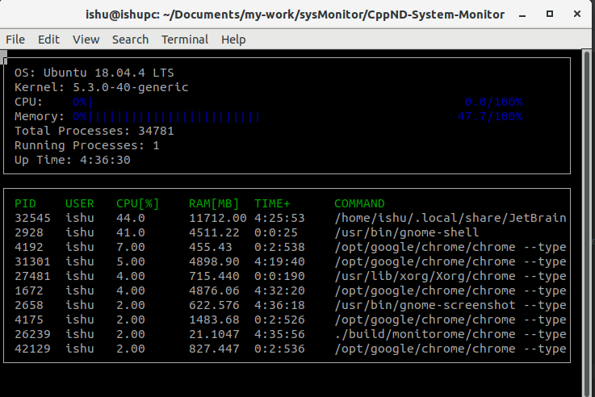

# Ubuntu System-Monitor

## Similar to Htop
1. Uses filesystem library from  STL(C++ 17)
2. Computes active processor usage in very 5 millisecond
2. Uses priority queue to keep just top 10 process with high cpu usage
## Running project
1. Clone the project repository

2. Build the project: `make build`

3. Run the resulting executable: `./build/monitor`

## ncurses
[ncurses](https://www.gnu.org/software/ncurses/) is a library that facilitates text-based graphical output in the terminal. This project relies on ncurses for display output.

## Make
This project uses [Make](https://www.gnu.org/software/make/). The Makefile has four targets:
* `build` compiles the source code and generates an executable
* `format` applies [ClangFormat](https://clang.llvm.org/docs/ClangFormat.html) to style the source code
* `debug` compiles the source code and generates an executable, including debugging symbols
* `clean` deletes the `build/` directory, including all of the build artifacts
